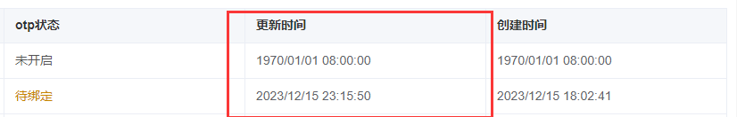

## 表格

### 时间戳的组件



```vue
<el-table-cloumn-ts prop="update_ts" label="userListView.updateTime" width="180" />
```

| 字段  | 作用             |
| ----- | ---------------- |
| prop  | 从哪个字段里取值 |
| label | 国际化文本       |
| width | 宽度             |


## 搜索框


```vue
<el-input-search
    v-model="searchAccount"
    placeholder="userListView.searchAccount"
    width="200"
    @search="requestUserList"
/>
```

| 字段        | 作用                      |
| ----------- | ------------------------- |
| v-model     | 搜索内容的变量            |
| placeholder | 输入框提示文本的国际化key |
| width       | 总宽度                    |
| search      | 搜索事件                  |
| max-length  | 最大长度                  |

## 对话框


| 输入参数 |          |      |
| -------- | -------- | ---- |
| title    | 标题     |      |
|          |          |      |
| prop     | 对应字段 |      |
|          |          |      |
|          |          |      |

